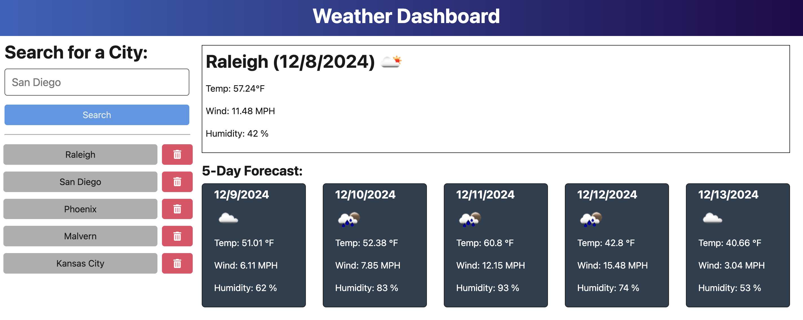

# API Weather Dashboard
This repository contains a dynamic weather forecast application that provides real time weather conditions and a 5-day forecast for any location of your choice. The application features a clean and user-friendly interface for quick access to accurate weather updates. Whether you're planning your day or the week ahead, this app provides all the essential weather details in a user-friendly format.

The Weather Dashboard fetches data from a weather API to display:
* Current Weather Conditions: Including temperature, humidity, wind speed, and weather description.
* 5-Day Forecast: A detailed forecast for the next five days, excluding the current day.
* City Search: Users can search for the weather in any city around the world.
The application dynamically updates the data based on user input and ensures an accurate and visually organized presentation of weather information.

## Deployed Application
Access the API Weather Dashboard deployed application [here](https://api-weather-dashboard.onrender.com).



## Table of Contents
* [Features](#features) 
* [Installation](#installation)
* [Usage](#usage)
* [License](#license)
* [Acknowledgements](#acknowledgements)
* [Contributing](#contributing)
* [Contact Information](#contact-information)

## Features
* Real Time Weather Data: Utilizes a reliable weather API to provide up-to-date information.
* Responsive Design: Optimized for various screen sizes, ensuring usability on both desktop and mobile devices.
* User Friendly Interface:  Intuitive navigation, easy search management, and a clear display of weather details.

## Installation
For installation of this application you will need to: 
1. Fork the repo to your local machine
2. Navigate to the project directory
3. Install the necessary dependencies using:
```
npm install
```
4. Run the application:
```
npm start
```

## Usage
Make the most of the Weather Dashboard by using its key features to: 
* Search for a City: Enter the name of the desired city in the search bar and press Enter or click the search button.
* View Current Weather: The app will display the current weather conditions, including temperature, humidity, wind speed, and weather description.
* Check the 5-Day Forecast: Scroll down to view the 5-day weather forecast, which includes key details for each day.
* Manage Search Data: Remove any previously searched city from the search history to keep your list relevant and organized.

## License
This project is licensed under the ISC license.

## Acknowledgements
OpenWeatherMap for the weather API.

## Contributing
Contributions welcome for this project! Feel free to fork the repository, make your changes, and submit a pull request.

## Contact Information
For any questions feel free to contact me on GitHub: celeste-hayes
